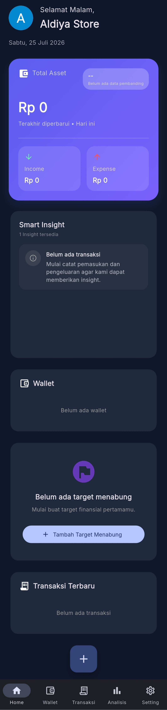
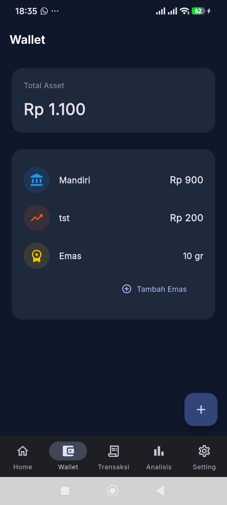
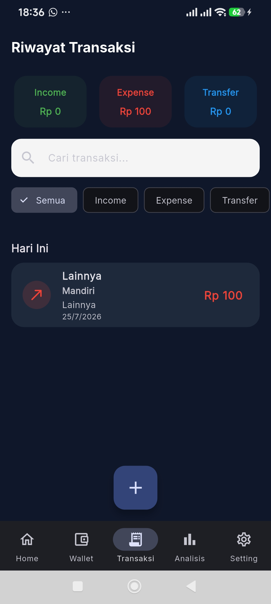
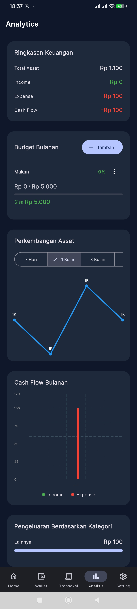
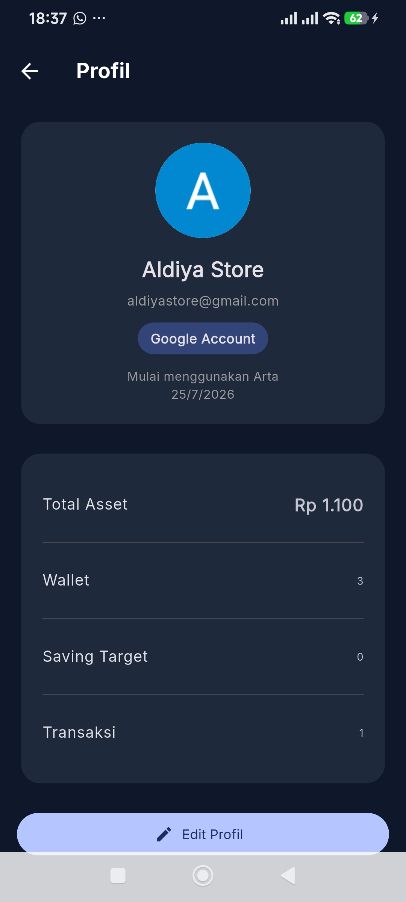

# 💰 ARTA - Personal Finance Manager

ARTA adalah aplikasi manajemen keuangan pribadi yang dibuat menggunakan **Flutter** untuk membantu mencatat pemasukan, pengeluaran, aset, dan target keuangan dalam satu aplikasi yang sederhana dan modern.

---

## ✨ Preview

| Dashboard | Wallet |
|-----------|--------|
|  |  |

| Transaction | Analytics |
|-----------|--------|
|  |  |

| Profile |
|---------|
|  |
---

# 🚀 Fitur

### 🔐 Authentication
- Login Email & Password
- Register Account
- Login dengan Google
- Auto Login (Firebase Authentication)
- Logout

---

### 💳 Wallet Management

- Tambah Wallet
- Edit Wallet
- Hapus Wallet
- Multi Wallet
- Cash
- Bank
- Reksa Dana
- Emas

---

### 💸 Transaction

- Income
- Expense
- Transfer antar Wallet
- Riwayat Transaksi
- Kategori Transaksi

---

### 🎯 Saving Target

- Membuat Target Tabungan
- Progress Target
- Nominal Target
- Deadline

---

### 📊 Analytics

- Total Asset
- Income vs Expense
- Distribusi Wallet
- Saving Progress
- Financial Summary

---

### 👤 Profile

- Edit Nama
- Edit Target Finansial
- Avatar
- Informasi Pengguna

---

### ⚙ Settings

- Dark Mode
- Light Mode
- Currency
- About
- Rate App

---

### 📄 Export

- Export PDF
- Export Excel

---

# 🛠 Built With

- Flutter
- Dart
- Firebase Authentication
- Google Sign In
- Hive Database
- Excel Package
- PDF Package
- Material Design 3

---

# 📱 Platform

- Android ✅
- iOS (Supported)
- Windows
- Web

---

# 📂 Project Structure

```
lib/
│
├── app/
├── core/
├── data/
├── features/
│   ├── auth/
│   ├── dashboard/
│   ├── wallet/
│   ├── transaction/
│   ├── analytics/
│   ├── goals/
│   ├── profile/
│   └── settings/
│
├── services/
└── main.dart
```

---

# 📸 Screenshots

Coming Soon

---

# 🗺 Roadmap

## Version 1.1

- Firebase Cloud Firestore
- Cloud Sync
- Budget Notification
- Monthly Report
- Search Transaction

---

## Version 1.2

- Recurring Transaction
- PIN Lock
- Fingerprint Login
- Charts Improvement
- Backup & Restore

---

## Author

**Didi Rohadi**

Manual QA Engineer • Flutter Enthusiast

GitHub:
https://github.com/didirohadii

---

## License

This project is licensed under the MIT License.